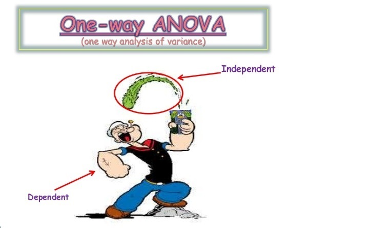

# One-way-analysis-of-varience

:warning: Important note: If you get the message "Sorry, something went wrong. Reload?" when viewing an *.ipynb - try to open that notebook using nbviewer online, here is the link: \
https://nbviewer.jupyter.org/github/loudlemon/One-way-analysis-of-varience/blob/master/One-way%20analysis%20of%20varience.ipynb \
This site nbviewer works independently of github.

Dataset for analysis was obtained at www.statstutor.ac.uk \
This dataset contains information on 78 people using one of three diets.\
Research quetions:

 One-way ANOVA
  - Which diet was best for losing weight?
  - Are there gender differences for weight loss?
  
Interactions
  - Means plot of weight lost by diet and gender

